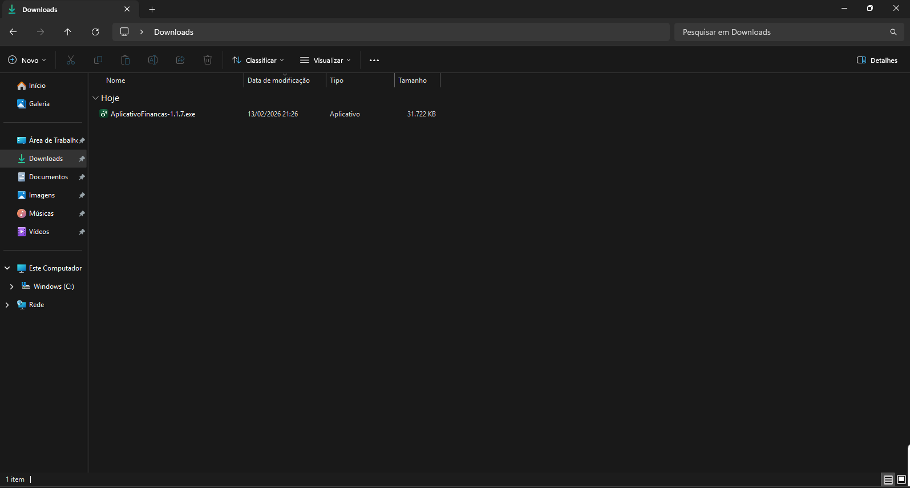
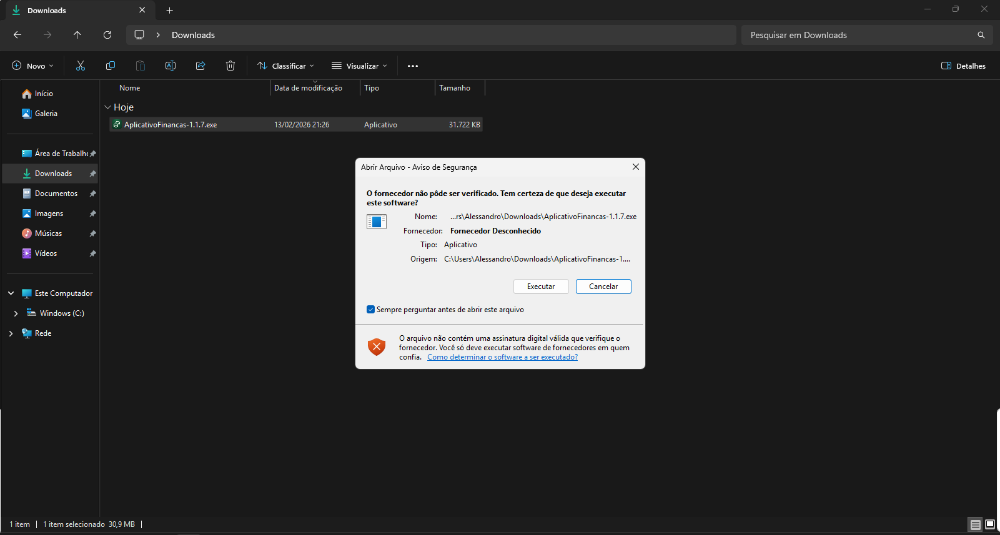
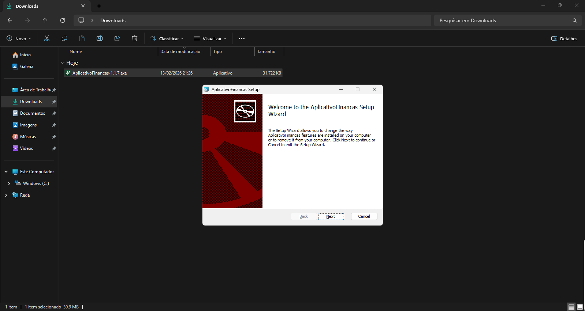
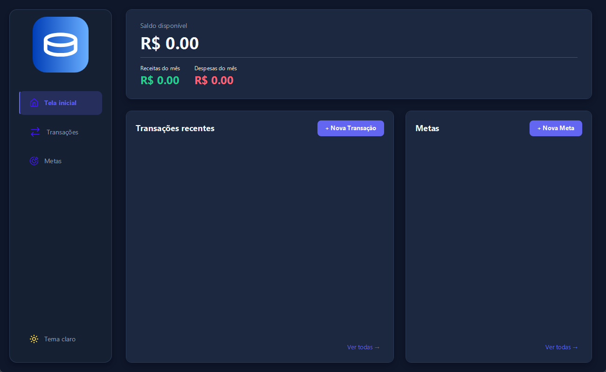
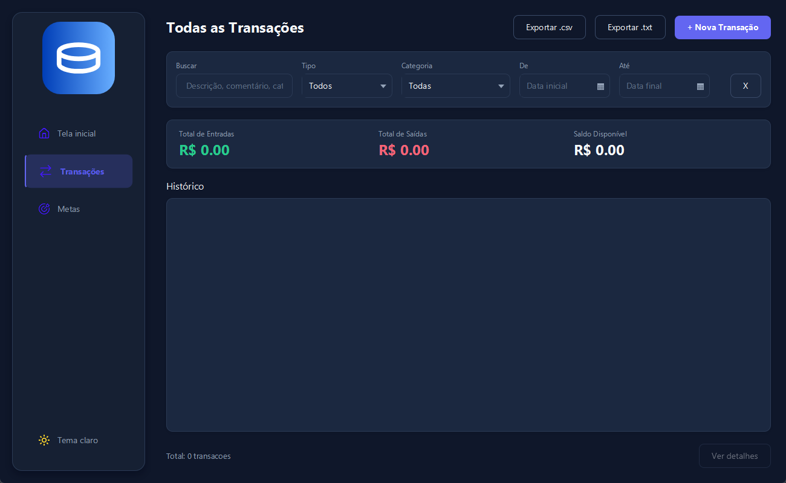
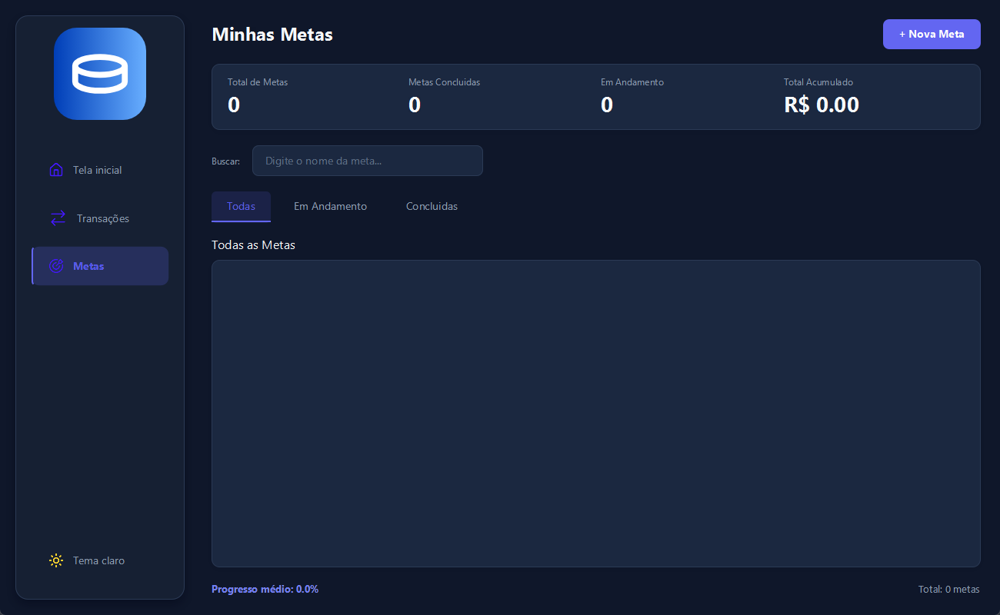
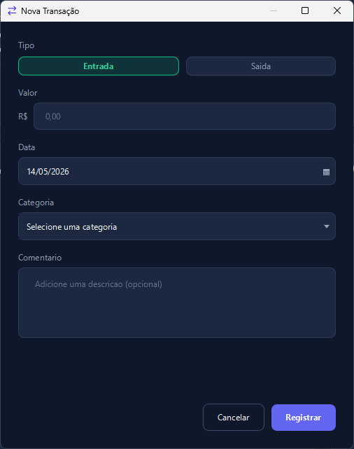
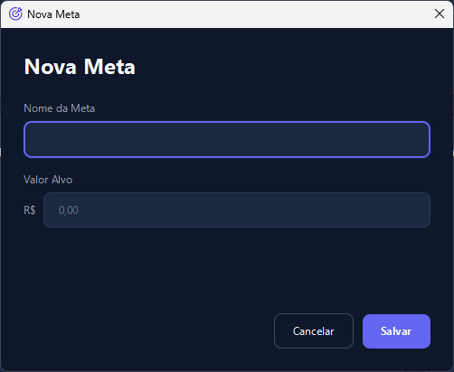

# Smart Finance

Smart Finance é um aplicativo desktop para controle financeiro pessoal, feito em JavaFX com persistência local em SQLite. O projeto foi desenvolvido para fins de estudo, explorando interface desktop, organização em camadas, acesso a banco de dados, exportação de dados, testes automatizados e primeiras práticas de segurança.

## Funcionalidades

- Cadastro, edição e exclusão de transações.
- Separação entre entradas e saídas.
- Categorias financeiras com regras específicas para metas.
- Comentários em transações.
- Busca de transações por descrição, comentário, categoria, tipo e data.
- Filtros por tipo, categoria e período.
- Exportação de transações em `.csv` e `.txt`.
- Criação e acompanhamento de metas financeiras.
- Dashboard com saldo disponível, receitas do mês, despesas do mês, transações recentes e metas.
- Interface com tema claro e escuro.
- Persistência de dados em SQLite.
- Otimizações de banco com índices e busca textual FTS5.
- Base inicial de segurança com criptografia AES-GCM e chave fora do código/banco pelo Windows Credential Manager.

## Instalação

Disponível somente para Windows.

Baixe o instalador `SmartFinance-2.1.0.exe` na área de releases do repositório:

<div align="center">

[](https://github.com/AlessandroCoranFilho123/smart-finance)
</div>
Depois, siga o assistente de instalação:

<p align="center">
  
  
  
</p>

## Interface

<p align="center">
<h6 align="center">Tela inicial</h6>
  
  <h6 align="center">Tela de transações</h6>
  
  <h6 align="center">Tela de metas</h6>
  
  <h6 align="center">Janela de Nova Transação</h6>
  
  <h6 align="center">Janela de Nova Meta</h6>
  
</p>

## Dados e segurança

O banco de dados é local. Em ambiente instalado, os dados ficam em:

```text
%APPDATA%\SmartFinance\financas.db
```

O projeto usa `PreparedStatement` nas operações de banco, `PRAGMA foreign_keys`, índices para consultas frequentes e FTS5 para busca textual. Também há uma base de criptografia com AES-256-GCM e gerenciamento de chave pelo Windows Credential Manager.

## Desenvolvimento

Para executar o projeto em ambiente de desenvolvimento:

```bash
mvn javafx:run
```

Para rodar os testes:

```bash
mvn test
```

Para empacotar dependências usadas no instalador:

```bash
mvn package
```

## Tecnologias utilizadas

- Java 21
- JavaFX 21.0.9
- CSS
- Maven
- SQLite JDBC 3.45.3.0
- JNA 5.14.0
- JUnit 5.10.1
- Mockito 5.8.0
- jlink / jpackage