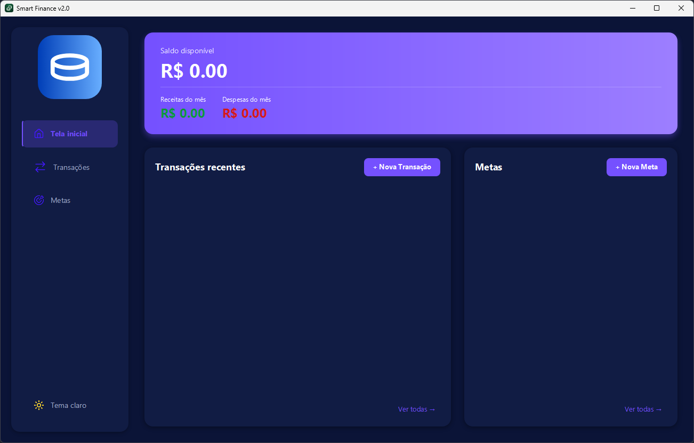
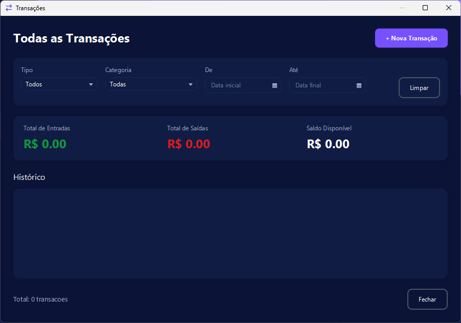
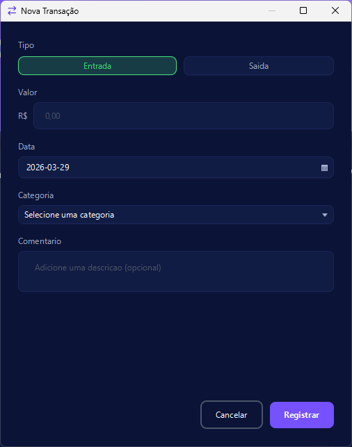
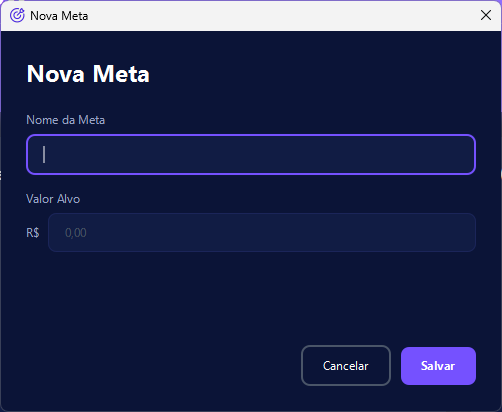

# Smart Finance

Smart Finance é um aplicativo desktop para cuidar de seus gastos. Lembrando que foi construído apenas para fins
de estudo.

## Funcionalidades

- Cadastro de transações
- Criação de metas
- Controle de metas financeiras
- Interface com tema claro e escuro
- Persistência de dados

## Instalação

Disponível somente para windows, instale a versão com extensão ".exe" ("AplicativoFinancas-2.0.0.exe"):

    
    
    
    
## Interface

    
    
    
    
    

## Tecnologias utilizadas

- Java 21.0.9 (LTS)
- JavaFX 21.0.10
- Css
- Maven
- SQLite 3.45.3
- jlink / jpackage